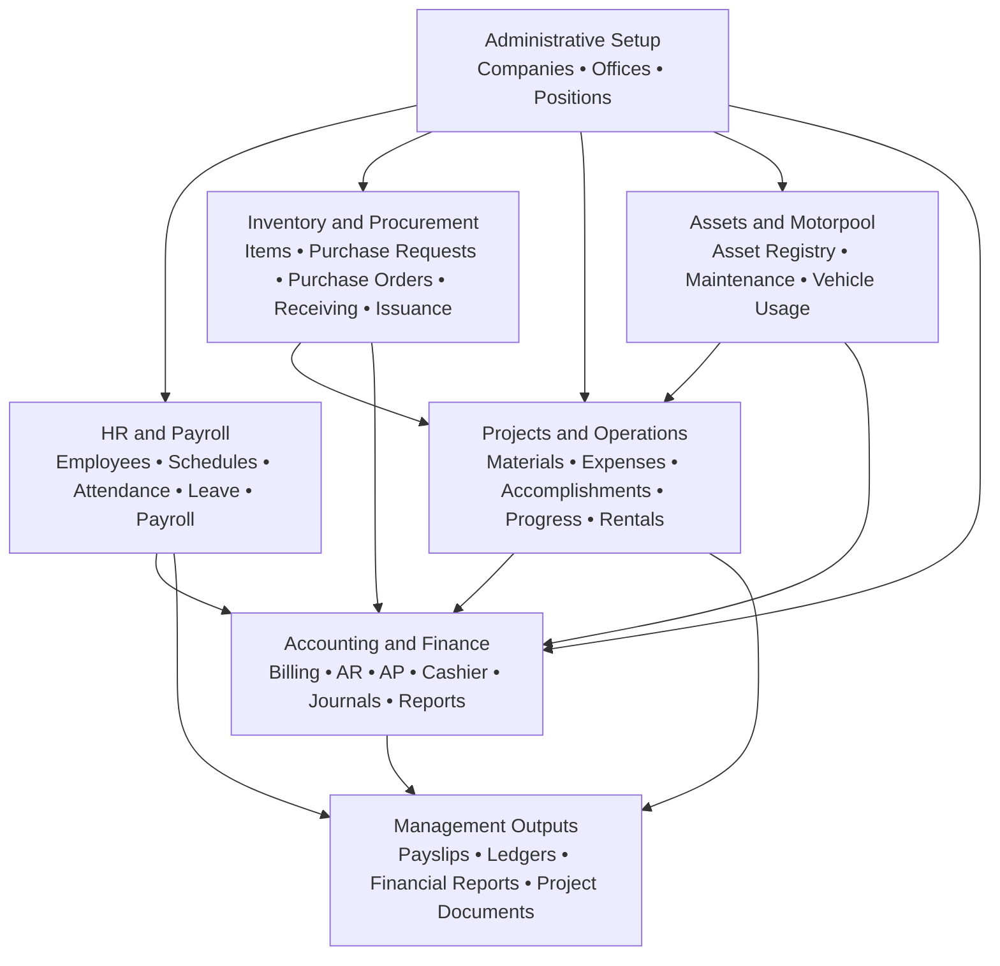

# DiverseTrade Commercial Overview

Integrated business operations platform for construction, project-driven, and multi-company organizations.

> Image placeholder: Add a hero banner or dashboard collage that shows payroll, accounting, inventory, project, and asset views in one unified layout.

## Executive Summary

DiverseTrade is a centralized business solutions platform built to help organizations manage operations, finance, workforce administration, inventory movement, project visibility, and asset control in one environment. It is especially well-positioned for construction companies, contractors, engineering firms, and other project-based businesses that need tighter coordination between field activity and back-office control.

Instead of working across disconnected spreadsheets, manual approvals, and separate systems for payroll, procurement, billing, receivables, payables, inventory, and project tracking, DiverseTrade brings those workflows together into a more connected operating model. The result is better visibility, faster processing, stronger accountability, and clearer decision-making across management, finance, HR, procurement, and operations teams.

## Positioning Statement

DiverseTrade helps businesses unify people, projects, materials, finance, and operational control in one digital platform.

## System Flow Diagram

This diagram presents the platform at a commercial level: administrative setup establishes the operating structure, core modules handle day-to-day activity, and the resulting transactions flow into management outputs such as payroll documents, financial reports, ledgers, and project records.

## Why Businesses Choose DiverseTrade

- Reduce manual handoffs between payroll, accounting, purchasing, warehouse, and project teams.
- Improve visibility from procurement and stock movement to billing, collection, and financial reporting.
- Strengthen payroll accuracy with organized attendance, schedules, allowances, loans, deductions, and contribution tracking.
- Support management with clearer oversight of receivables, payables, transaction journals, and financial reports.
- Keep project execution aligned with materials, expenses, accomplishments, and cost-related activity.
- Enable multi-company operations with centralized administrative setup and company-aware access.

> Image placeholder: Add a value proposition graphic or a process flow that shows how departments connect through the platform.

## Core Business Modules

### HR and Payroll Management

DiverseTrade supports the full employee administration cycle, from employee master records to payroll release. The platform includes employee profile management, work schedule setup, attendance tracking, leave management, allowance handling, employee loans, payroll processing, withholding tax support, contribution management, and payslip-ready workflows.

This makes it easier for HR and payroll teams to manage workforce data accurately while reducing delays and manual reconciliation during each payroll cycle.

> Image placeholder: Add a payroll dashboard, employee profile screen, or payslip preview.

### Accounting and Financial Control

The accounting suite is built to support day-to-day financial operations as well as management reporting. Available functions include billing, over-the-counter transactions, cashiering, accounts receivable, accounts payable, loan management, fixed asset support, transaction journals, accounting setup, and financial report generation.

This creates a stronger financial control environment for organizations that need both transaction-level detail and executive-level reporting.

> Image placeholder: Add an accounting dashboard, financial report sample, or billing and receivables screenshot.

### Inventory, Procurement, and Warehouse Operations

DiverseTrade helps businesses manage the movement of materials and supplies through a more structured inventory workflow. Capabilities include item masterfile management, purchase requests, purchase orders, delivery receiving, returns, stock issuance, quantity adjustments, beginning balances, markup control, and inventory monitoring.

For organizations that rely on timely material availability and controlled stock movement, this module supports better planning, cost visibility, and inventory discipline.

> Image placeholder: Add a procurement screen, receiving workflow, or inventory monitoring dashboard.

### Project Monitoring and Cost Visibility

The platform includes project-oriented workflows that support operational visibility beyond the warehouse or finance office. Project-related functions include project management, bill quantities, materials tracking, purchase requests, purchase orders, expenses, rentals, work accomplishments, and project progress monitoring.

This is particularly valuable for construction and project-based teams that need a better view of how materials, costs, and accomplishments move together at the project level.

> Image placeholder: Add a project progress dashboard, accomplishments screen, or project cost overview.

### Asset and Motorpool Management

DiverseTrade extends operational control into asset-heavy environments through asset registration, maintenance-related workflows, vehicle usage monitoring, rental rate tracking, repair and maintenance support, and upcoming maintenance visibility. This helps organizations improve equipment readiness, reduce avoidable downtime, and keep asset usage more transparent.

> Image placeholder: Add an asset maintenance screen, vehicle usage view, or motorpool dashboard.

### Administrative Control and Organizational Setup

To support growing businesses and structured operations, DiverseTrade includes administrative tools for company management, office setup, and position management. These functions help standardize organizational records and support multi-company environments with clearer internal control.

> Image placeholder: Add a company setup, office configuration, or user administration screen.

## Platform Strengths

- Unified operations across HR, payroll, accounting, inventory, projects, assets, and administration.
- Multi-company capability for businesses managing more than one legal entity or operating group.
- Role-aware access and permission-based workflows to support controlled user access.
- Document and image upload support for operational records and project-related files.
- Printable and exportable outputs for documents, reports, ledgers, and payroll-related records.
- Centralized reporting structure for faster review, audit preparation, and management visibility.

## Ideal Clients

- Construction companies and general contractors
- Engineering and project-based service firms
- Businesses managing materials, field operations, and finance in one organization
- Multi-branch or multi-company groups that need centralized control
- Teams replacing spreadsheet-heavy workflows with a more integrated platform

## Business Value

DiverseTrade is designed to create measurable business value in areas that directly affect operational performance:

- Faster turnaround for payroll, billing, collections, procurement, and report generation
- Better control over project costs, inventory movement, and financial obligations
- Improved internal coordination across departments that normally operate in silos
- Stronger traceability for employee, financial, project, and operational records
- Clearer management insight for planning, review, and executive reporting

## Commercial Summary

DiverseTrade is more than a payroll or accounting tool. It is a connected operations platform for businesses that need workforce management, financial control, procurement, inventory, project oversight, and asset visibility to work together in a practical, structured, and scalable way.

For organizations operating in construction and other project-driven industries, DiverseTrade offers a strong foundation for digitizing daily operations while giving leadership better visibility into how the business performs.

## Suggested Image Placement Guide

If this document will be used for presentations, proposals, or a sales-facing README, these image placements will work well:

1. Hero dashboard collage at the top of the page
2. Payroll and employee management screenshot under the HR and Payroll section
3. Financial reports, AR, AP, or cashier screenshot under Accounting and Financial Control
4. Procurement, receiving, or stock monitoring screenshot under Inventory
5. Project monitoring or accomplishments screenshot under Project Monitoring
6. Asset maintenance or motorpool screenshot under Asset and Motorpool Management

## Call to Action Placeholder

Replace this section later with your preferred closing line, such as:

**Request a demo. Explore a module walkthrough. See how DiverseTrade can simplify your operations from payroll to project delivery.**
