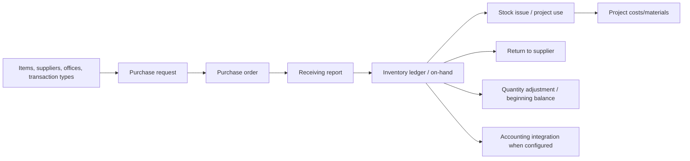
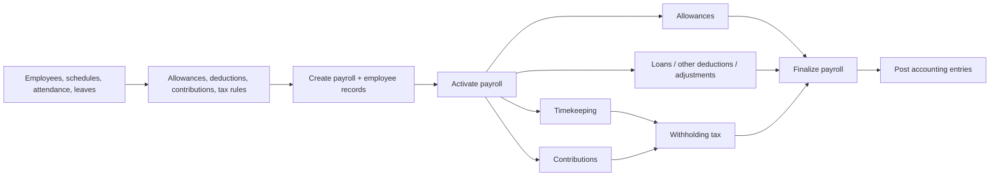

# Backend Domain Workflows

## Shared business rules

### Company isolation

Most operational data is company-scoped. A login resolves the employee’s current company, and service/query code commonly writes or filters with that context. Company selection, administration, cross-company reporting, and superuser behavior are sensitive exceptions. Trace both the service and its repository/native query before changing scope logic.

### Statuses and finalization

Many modules implement draft/active/finalized/locked-style behavior. Treat a status mutation as a business event, not a scalar update: it may create dependent rows, block edits, calculate values, issue inventory, post a ledger entry, or control reporting. Search the specific service for its transition checks and all call sites before adding a shortcut mutation.

### Accounting integration

Accounting is shared infrastructure across inventory, billing, payroll, cash, AP/AR, and assets. Services under `graphqlservices/accounting/` include ledgers, journal transactions, integration groups/items, AP, AR, disbursement, withholding tax, and reports. When changing a source module, trace calls to integration/ledger services and validate the source record plus the accounting result.

## Administration and shared master data

Core entities include users, authorities, permissions, group policies, company settings, offices, positions, addresses, and notifications. Their GraphQL services sit directly under `graphqlservices/`, with address-related functions in `graphqlservices/address/`.

User authentication loads roles and the employee’s current company. Roles and permission data are part of the security model, so feature migrations that introduce protected actions may also need permission/role seed changes. Do not confuse frontend visibility with server authorization.

## Inventory and purchasing

The inventory module covers item/supplier master data, categories/groups/units, office items, beginning balances, transaction types, purchase requests, purchase orders, receiving reports, returns to supplier, quantity adjustments, material production, stock issuance, attachments, and inventory ledger/monitoring.

Primary services are in `graphqlservices/inventory/`; persistent types are in `domain/inventory/`; specialized report/export endpoints live in `rest/InventoryResource.groovy` and `rest/InventoryReportResource.groovy`.

Change guidance:

- Preserve quantity, weighted-cost/on-hand, office, item, and company behavior together. A change to an inventory document frequently affects ledger/report queries.
- Preserve source-document/item child consistency. Purchase, receiving, stock issue, and return services have paired header/item services and repositories.
- For project material changes, review both inventory and `graphqlservices/projects/` services.
- Validate an ordinary transaction, reversal/return/adjustment path, and the relevant report before handoff.

## Accounting, billing, AP, AR, and cashiering

The accounting domain includes fiscal periods, parent/sub accounts, header groups/ledgers, journal transactions, integrations, financial report layouts, banks, AP, AR, credit notes, invoices, payments, disbursements, checks, petty cash, loans, withholding tax, and account templates.

Related business features are distributed as follows:

| Area | Principal GraphQL packages/services | Important related data |
| --- | --- | --- |
| Financial setup and ledger | `accounting/` ledger, header group, fiscal, parent/sub-account, transaction-journal services | chart structure, fiscal period, journals, ledger lines |
| Accounts payable | AP, AP detail/ledger, template, debit memo, disbursement, reapplication, release check services | payables, disbursement components, checks, petty cash, withholding tax |
| Accounts receivable | customer, invoice, invoice items/particulars, payment posting, credit note, transaction ledger services | customers, invoices, allocations, payments, credit notes |
| Billing | `billing/` jobs, billing, billing items, charge invoices, customer and service setup | job/billing documents, charge invoice, discounts |
| Cashiering | `cashier/` payment, terminal, shift, petty cash/type services | terminals, shifts, payment targets/items |
| Reports | REST report resources plus financial/GL resources | PDF/CSV output and report layouts |

Work from the source document outward: validate the business document, its items/details, status/lock rule, generated ledger or payment allocation, and the corresponding report. Never “repair” an accounting discrepancy by directly editing ledger rows unless a specifically reviewed accounting-correction workflow exists.

## HR and payroll

HRM manages employees, attendance/accumulated logs, schedules/schedule locks, leave, events/holidays, allowances/packages/items, salary rate multipliers, employee documents, and filtering. Payroll adds company payroll setup, contribution matrices, withholding-tax matrix, employee loans, deductions/adjustments, payroll periods, employee submodule records, and payroll-to-accounting posting.

### Payroll lifecycle

1. HR/payroll reference data and employee attendance/schedule context must exist.
2. `upsertPayroll` creates or updates a payroll. New payrolls begin in `DRAFT` and create payroll-employee records for the selected employees.
3. `updatePayrollStatus(..., ACTIVE)` triggers all registered `IPayrollModuleBaseOperations` to initialise payroll processing.
4. Per-employee and module services calculate/recalculate and transition timekeeping, allowances, contributions, loans, deductions, adjustments, and withholding tax.
5. `updatePayrollStatus(..., FINALIZED)` invokes payroll accounting posting and persists the finalized status.

The critical orchestration is `graphqlservices/payroll/PayrollService.groovy`; module registration is verified in `config/PayrollConfig.groovy`; per-employee controls are coordinated in `PayrollEmployeeService.groovy` and the module-specific services. The server enforces some module prerequisites—e.g. withholding-tax calculations require finalized timekeeping and contributions for eligible employees. Preserve those checks and use the established recalculation paths.

Do not directly update payroll child tables to bypass a status, regenerate only one record without understanding aggregate totals, or finalize a payroll simply because a UI screen permits it. Verify employees, module totals, final status, and ledger posting in a safe environment.

## Projects and assets

Projects include project records, costs/revisions, progress, updates, materials, workers, work accomplishments/items, and progress images. Assets include registered assets, maintenance types, preventive and repair maintenance, rental rates, job orders/items, vehicle usage monitoring/accumulation/employees/documents, and upcoming-maintenance views.

Project and asset data has links to inventory, workforce, billing, fixed assets, and accounting. Relevant source packages are `graphqlservices/projects/`, `graphqlservices/assets/`, and `graphqlservices/fixed_asset/`; report/file routes include `ProjectResource`, `AssetResource`, and inventory/report resources. For any change, trace linked stock issues, direct expenses, project costs, attachments/object storage, and downstream report calculations.

## Reports, notifications, and external processes

Reporting logic is split between GraphQL read services and REST resources that render/download PDFs and CSVs. Notifications/schedulers, DigitalOcean file storage, SOAP support, and optional STOMP WebSockets are infrastructure integrations around the business modules. These are not safe places to bypass workflow or authorization checks: reports and background notifications must use the same company and document state constraints as interactive requests.
