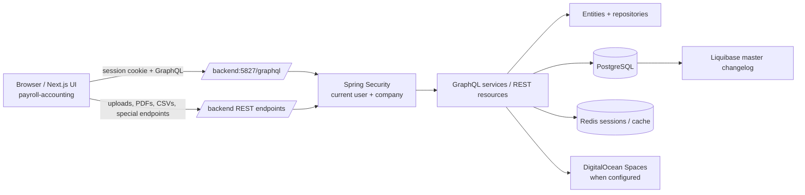

# DiverseTrade System Guide

This is the working reference for people and AI agents changing the active DiverseTrade application. It documents the repository as it exists today; validate a task against the code when a business rule is safety-critical.

## Scope and ownership

The active applications are deliberately separate:

| Directory | Responsibility | Primary stack |
| --- | --- | --- |
| `backend/` | API, persistence, business workflows, authentication, reports, and integrations | Groovy/Java 8, Spring Boot 2.1, Spring Data JPA, PostgreSQL, Redis, GraphQL SPQR, Liquibase |
| `payroll-accounting/` | Browser application for inventory, accounting, HR, payroll, projects, and administration | Next.js 13 Pages Router, React 18, TypeScript, Apollo Client, Ant Design |

`frontend/` also exists at the repository root but is **not** the frontend named by this guide. Do not make changes there for a `payroll-accounting` task unless the request explicitly includes it.

`AGENTS.md` is the short mandatory operating guide. Read this document for the system details before making a cross-cutting change.

For backend-specific implementation and operations detail, use the [backend documentation set](../backend/docs/README.md).

For frontend-specific implementation and operations detail, use the [payroll-accounting documentation set](../payroll-accounting/docs/README.md).

## System at a glance



The browser first submits credentials to `POST /api/authenticate`. Spring Security creates the server-side session; Apollo and Axios send cookies with `credentials` / `withCredentials` enabled. The application bootstrap then asks GraphQL for `account`, establishes the current user/company context, renders the common layout, and lets page-level role/permission controls gate UI actions.

Most business reads and writes use `/graphql`. REST is intentional for multipart uploads, rendered reports/downloads, biometric/attendance integrations, and a few older/specialized APIs. Do not add a REST endpoint just because it is quicker when an existing GraphQL service is the established feature boundary.

## Functional map and core flows

The product is an operational suite, not a standalone payroll app. The major modules visible in the main menu are:

- **Inventory:** master data, suppliers/items, purchase requests/orders, receiving, returns, issuances, stock adjustments, projects, assets, and monitoring.
- **Accounting:** chart of accounts and period setup, journals, AP, AR, billing, cashiering, loans, fixed assets, and financial/ledger reports.
- **HR and payroll:** employees, schedules/attendance/leaves, allowance and deduction configuration, contributions/tax tables, and payroll processing.
- **Administration:** company, office, position, user/role/permission, and other shared setup.

### Payroll lifecycle

Payroll is the most stateful workflow and must be treated as a transaction/process, not a collection of independent screens.

1. Configure employees, work schedules/attendance and payroll reference data (allowances, deductions, government contributions, tax, adjustment categories).
2. Create a payroll with the selected employees. The backend creates payroll-employee records and starts the payroll in `DRAFT`.
3. Move the payroll to `ACTIVE`. The service dispatches the registered payroll-module operations to initialise/process its employee data.
4. Process submodules such as timekeeping, allowances, contributions, loans, other deductions, adjustments, and withholding tax. Employee and module records move between `DRAFT` and `FINALIZED`; UI and service rules impose dependencies (for example, withholding tax expects finalized timekeeping and contribution data).
5. Finalize the payroll only after its prerequisites are complete. The backend posts accounting entries as part of finalization.

The orchestration lives in `backend/src/main/groovy/com/backend/gbp/graphqlservices/payroll/PayrollService.groovy`, the module interface/implementations under the same package, and `PayrollConfig.groovy`, which rejects missing or duplicate module registrations. Preserve status guards, recalculation behavior, and ledger posting when changing payroll. Do not update child tables directly to “fix” a payroll state.

### Cross-module accounting rule

Transactions in inventory, payroll, billing, AP/AR, assets, and cashiering can affect accounting. Before modifying a posting/finalization/status path, trace its use of the accounting services and its journal/ledger entities. Test both the source document and its expected ledger effect. `accounting.autopostjournal` and `accounting.enable_costing` are configuration flags, so do not assume posting behavior is identical in every environment.

### Tenant/company rule

The current company comes from the authenticated Spring Security principal (`SecurityUtils.currentCompany()` / `currentCompanyId()`). Entities and queries frequently carry or filter by company. New business records, queries, reports, and file-access checks must preserve this boundary; never accept a client-supplied company ID as a substitute for the authenticated company without an explicit, reviewed cross-company use case.

## Local development

### Prerequisites

- JDK 8 (the backend sets `sourceCompatibility = 1.8` and its container image is Java 8 based).
- PostgreSQL and Redis available to the backend development profile.
- Node.js 16 is the known container baseline; Yarn 1 is included as a dependency and used by the Docker build.
- Access to the backend’s configured private Maven repository. Gradle expects `mavenUser` and `mavenPassword`; obtain them through the team’s approved secret-management process.

### Start the backend

The local profile targets PostgreSQL and Redis on `localhost` and the API port is `5827`. Ensure the database is a safe local development database before booting: application startup constructs a `SpringLiquibase` bean pointing at `config/liquibase/master.xml`.

```bash
cd backend
./gradlew bootRun --args='--spring.profiles.active=dev'
```

Useful build check:

```bash
cd backend
./gradlew build
```

There is no `backend/src/test` directory in the current tree. A successful build is a compile/package check, not evidence that business behavior was tested. For behavior changes, exercise the affected GraphQL/REST workflow against disposable local data and document what you verified.

### Start the frontend

```bash
cd payroll-accounting
yarn
yarn dev
```

`yarn dev` explicitly starts Next.js on **port 7001**. The GraphQL/REST base URL in `shared/settings.ts` is `http://localhost:5827` in development. One `frontEndUrl` setting still says `http://localhost:6060`; that is inconsistent with the script and only affects code using that setting. Keep this mismatch in mind when testing links, and fix it deliberately as a separately reviewed configuration change rather than silently relying on it.

The login form imports `defaultaccount` only in development. Do not create or commit real credentials to satisfy that import. Use a locally provisioned, ignored development-only file only if the team’s setup requires it.

Useful frontend checks:

```bash
cd payroll-accounting
yarn lint
yarn build
```

### Environment and secret handling

Application property files and the frontend code-generation configuration currently contain environment-sensitive connection/credential material. Treat all such values as secrets even if they are already tracked:

- Never copy them into tickets, chat, generated documentation, test fixtures, or new source files.
- Do not point local code at production databases, production Redis, or production object storage merely to make a feature work.
- Use injected environment variables or approved local secret storage for new credentials; do not extend the existing pattern of hard-coded values.
- Flag exposed/obsolete credentials to the maintainers for rotation rather than placing the value in a change description.

## Backend architecture and change patterns

### Where code belongs

| Location | Use it for |
| --- | --- |
| `domain/` | JPA entities, domain enums, DTOs, and shared data structures |
| `repository/` | Spring Data repositories and database-oriented queries |
| `graphqlservices/` | Primary application use cases exposed through GraphQL |
| `services/` | Reusable infrastructure/application services (generators, notifications, storage, scheduling) |
| `rest/` | Purpose-built REST resources, mainly uploads, downloads, reports, and integrations |
| `security/`, `config/` | Auth/session/company context and application wiring |
| `resources/config/liquibase/` | Ordered database migrations, loaded from `master.xml` |
| `resources/reports/` | Report templates/assets used for exported documents |

The GraphQL API is annotation-driven rather than schema-first: services are Spring `@Component`s annotated `@GraphQLApi`, with `@GraphQLQuery`, `@GraphQLMutation`, and named `@GraphQLArgument`s. The frontend obtains its schema from the running endpoint; there is no checked-in `.graphqls` API schema to edit for these services.

For a standard new use case:

1. Find the closest existing service in the same business module and follow its query/mutation and response conventions.
2. Add/extend a domain entity and repository only when persistence really changes.
3. Add the GraphQL query or mutation, use explicit argument names, enforce the current company and permissions, and wrap multi-write workflows in `@Transactional(rollbackFor = Exception.class)`.
4. Use the existing `ObjectMapper` map-to-entity approach and `GraphQLResVal` response convention where the neighboring service does so; do not create a competing contract style within one module.
5. Add a REST resource only for an HTTP concern that GraphQL does not fit (e.g., multipart upload, binary report/download).
6. Update the frontend and regenerate GraphQL types if it consumes a changed schema.

Repositories may contain native queries, views, pagination, and company-specific filters. Preserve their expected parameter types and pagination convention: Spring `PageRequest` is zero-based.

### Authentication and authorization

- `POST /api/authenticate` accepts form-encoded `username` and `password` and creates the session.
- `/graphql/**`, `/graphiql/**`, and `/api/**` are authenticated. `/public/**`, `/ping`, selected legacy paths, and `/ws/**` have distinct rules—do not broaden them casually.
- The frontend’s `AuthManager` makes the `account` GraphQL query before rendering authenticated pages. It redirects 401s to `/login` and shows 403 UI for authorization failure.
- Page wrappers use `AccessManager` for role checks such as `ROLE_ADMIN`; controls/actions may use `AccessControl` for fine-grained permission (`user.access`) checks. UI checks are not a server-side security boundary, so backend mutations must still enforce authorization where appropriate.

The frontend always sends cookies (`credentials: "include"` and Axios `withCredentials`). Do not replace this with an invented bearer-token flow without a repository-wide authentication design change.

### Database migrations

`DatabaseConfig.groovy` explicitly runs Liquibase from `classpath:config/liquibase/master.xml`. The master file is an ordered list spanning `changelog` through `changelog4` and includes SQL files directly.

For any schema/data change:

1. Create a new, clearly named migration in the newest appropriate changelog directory. Include both structural changes and any required roles/permissions/reference data.
2. Append exactly one include to `master.xml`; do not reorder prior includes.
3. Never edit, rename, delete, or re-run an already applied migration. Liquibase records checksums and production history depends on immutability.
4. Apply only against a disposable/local database first. Inspect the resulting schema and the affected workflow before considering deployment.

Database changes can be business-destructive. Never run manual cleanup, broad updates, or production migrations without explicit scope and a backup/rollback plan.

### Reports, files, and background work

Report endpoints under `rest/**` return PDFs/CSVs and use templates from `resources/reports`. Test them as downloaded/binary responses, not merely HTTP 200. Upload endpoints have a configured 50 MB request/file limit and interact with object storage configuration. Notifications, schedulers, WebSocket classes, and async services exist; preserve security/company context when adding asynchronous work.

## Frontend architecture and change patterns

### Routing and composition

This is a Next.js **Pages Router** application:

- `pages/` owns URL routes and normally contains a thin wrapper: title, dynamic/async route implementation import, `AccessManager`, and layout sizing.
- `routes/` owns most screen implementations, grouped by module.
- `components/` contains reusable UI, forms, dialogs, access controls, and workflow-specific widgets.
- `hooks/` contains reusable Apollo query/mutation behavior; `graphql/` contains shared operations and generated types.
- `pages/_app.tsx` installs Apollo and the authenticated application shell. Do not bypass it for a new protected page.

For a new screen, add the route implementation under the relevant `routes/<module>/...` directory, then add the corresponding `pages/...` wrapper with the intended title and role guard. Match nearby pages’ `dynamic` or `asyncComponent` loading pattern. Do not put a full feature implementation directly in `pages/` unless the surrounding module already does so.

### API and type generation

Apollo is configured in `utility/graphql-client.ts` to call `${apiUrlPrefix}/graphql`. Queries/mutations appear both in central `graphql/` files and feature-local hooks. Follow the closest module’s pattern rather than moving unrelated operations during a feature change.

Run code generation after a backend schema change that affects the UI:

```bash
cd payroll-accounting
yarn codegen
```

The current `codegen.ts` introspects the local API and has a checked-in session-cookie configuration. Do not place a real session cookie in commits, logs, or documentation. Supply/refresh local development auth through the approved process and treat generated `graphql/gql/` output as derived code: regenerate it, do not hand-edit it.

Apollo query defaults are deliberately `network-only` for direct queries and `cache-and-network` for watched queries. After a mutation, use the existing feature’s `refetch`, cache update, or query options so list/detail views reflect the server state; do not assume cache invalidation happens automatically.

### Authorization and workflow UI

Use the same `AccessManager` role gate as the nearest page and `AccessControl` for specific operation permissions. When changing transitions (especially payroll), render controls only for legal states, keep confirmation/error feedback, and invoke the server mutation rather than setting local status optimistically. A state button that merely looks disabled is not a valid business-rule implementation.

## Safe delivery workflow

Before editing:

1. Determine whether the request belongs to `backend/`, `payroll-accounting/`, or both; inspect the full flow before changing a cross-module feature.
2. Identify the data owner, current-company behavior, roles/permissions, statuses, reports, and accounting side effects.
3. Preserve unrelated working-tree changes. Do not format or refactor broad directories as incidental cleanup.

When implementing:

1. Make the smallest coherent change across database, backend contract, frontend call site, and access control.
2. Keep IDs and dates typed consistently (UUIDs, enum values, and Java/Groovy time values on the backend; generated GraphQL types in TypeScript).
3. Add a migration for persisted model changes and append it to the master file.
4. Regenerate frontend GraphQL types after schema changes and review the generated diff.
5. Do not expose credentials or alter deployment URLs/secrets as part of a feature unless explicitly requested and approved.

Before handoff:

1. Run the narrowest relevant check first, then `./gradlew build` for backend changes and/or `yarn lint` plus `yarn build` for frontend changes when dependencies/environment allow.
2. Exercise the changed user path with a safe local account and confirm both successful and denied/invalid-state behavior.
3. For financial/inventory/payroll changes, state whether ledger, status, and tenant behavior were verified; if not, name the remaining verification explicitly.
4. Report changed files, commands run, results, and constraints. Never include secret values in the report.

## Key source references

- Backend entry point: `backend/src/main/groovy/com/backend/gbp/BackendApplication.groovy`
- Database + Liquibase wiring: `backend/src/main/groovy/com/backend/gbp/config/DatabaseConfig.groovy`
- Security configuration: `backend/src/main/groovy/com/backend/gbp/config/MultiHttpSecurityConfig.groovy`
- Company context: `backend/src/main/groovy/com/backend/gbp/security/SecurityUtils.groovy`
- Payroll orchestration: `backend/src/main/groovy/com/backend/gbp/graphqlservices/payroll/PayrollService.groovy`
- Frontend application shell: `payroll-accounting/pages/_app.tsx`
- Frontend API client: `payroll-accounting/utility/graphql-client.ts`
- Route/page convention examples: `payroll-accounting/pages/payroll/payroll-management/index.tsx` and `payroll-accounting/routes/payroll/payroll-management/index.tsx`

Update this guide and `AGENTS.md` when the supported runtime, application boundary, auth mechanism, migration process, or major workflow changes.
