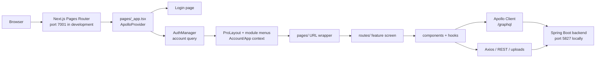

# Frontend Architecture

## Purpose and stack

The Payroll & Accounting frontend is the active browser client for the DiverseTrade suite. It is a **Next.js 13 Pages Router** application using React 18, TypeScript in strict mode, Apollo Client for GraphQL, Axios for REST, Ant Design/Ant Design Pro for UI, and a Spring Boot backend that owns authentication and business rules.

## Application bootstrap and authentication

`pages/_app.tsx` supplies the application-wide behavior:

1. Loads global/virtual-table/loader CSS.
2. Installs the singleton `ApolloProvider`.
3. Renders `/login` without the authenticated shell.
4. Wraps every other route in `AuthManager`.

`AuthManager` executes the GraphQL `account` query before rendering an authenticated page. It then:

- sends the account into `AccountContext`;
- clones page children with an `account` prop for established page components;
- installs `AppContextProvider` for project state;
- renders the dynamic, client-only `DiverseTradeLayout`; and
- supplies `ModalProvider` for hook-based dialogs.

Unauthenticated network failures redirect to `/login`; authorization failures render the 403 page. A new protected page should go through this shell automatically—do not independently fetch/construct a second user context.

Login is form-posted to the backend’s `/api/authenticate` endpoint through the shared Axios helper. The backend creates the HTTP session. The frontend does not own password validation or issue tokens.

## Routing and feature composition

The application has a deliberate split between route registration and screen implementation:

| Layer | Role | Example |
| --- | --- | --- |
| `pages/` | URL, title, dynamic import, page-level role guard and sizing | `pages/payroll/payroll-management/index.tsx` |
| `routes/` | Primary screen composition, tables, filters, action handlers, feature state | `routes/payroll/payroll-management/index.tsx` |
| `components/` | Reusable forms, dialogs, tables, pickers, display widgets | `components/payroll/`, `components/inventory/` |
| `hooks/` | Query/mutation behavior and reusable state/data transformations | `hooks/payroll/`, `hooks/inventory/` |
| `graphql/` | Shared GraphQL documents and generated schema types | `graphql/gql/` is generated |

Most page wrappers use `dynamic` or `asyncComponent`; the latter renders a standard progress state and disables SSR. Follow the loading/SSR pattern of the closest page rather than changing rendering strategy during a feature task. `pages/_document.tsx` handles Ant Design CSS-in-JS server style extraction and document-level font links.

Dynamic routes use the Pages Router convention (`[id].tsx`, `[account].tsx`). Read `router.query` defensively: it is unavailable during the earliest client render and can have array/string typing.

## Layout and navigation

`components/layout/index.tsx` owns the authenticated Ant Design Pro layout, theme, account menu/logout action, responsive behavior, global notification drawer, and navigation. Module/sidebar configuration lives in `components/layout/moduleSideBar/`; the main dashboard card menus live in `components/sidebar/` and `routes/menu/main.tsx`.

To add a screen that should be navigable:

1. Add the `pages/` route and the feature implementation.
2. Add/change the relevant module-sidebar route only when it should appear in sidebar navigation.
3. Add/change the dashboard menu card only when it should appear on the main menu.
4. Use an existing role/permission convention and verify both menu visibility and direct URL behavior.

Sidebars and menu cards are navigation affordances, not authorization. Direct URLs are still protected by the page/server behavior.

## State boundaries

| State | Owner | Use |
| --- | --- | --- |
| Server/cache data | Apollo `InMemoryCache` + feature query/hook | GraphQL query/mutation results |
| Authenticated account | `AccountContext` | roles, access permissions, office, current company, identity |
| Active project | `AppContext` | shared project screen state |
| Billing record | `BillingContext` | billing-related shared state where mounted |
| Local UI state | React `useState`, Ant Design forms, dialog hooks | filters, open modals, selections, pagination |

Do not use global context to duplicate query results merely to avoid refetching. Use the feature’s existing Apollo cache/refetch pattern so server state remains the source of truth.

## Styling and design system

`theme/themeConfig.ts`, `styles/`, Ant Design, and Ant Design Pro define the base visual system. Reusable form fields, selectors, tables, modals, typography, loaders, and utilities live under `components/common/`. Prefer them before adding a one-off control; this preserves formatting, accessibility, validation, and responsive behavior.

Dates are handled with `dayjs`; currency/number helpers use `numeral` and domain-specific helpers in `utility/helper.ts`. The backend uses UTC-oriented instants, so use the existing date-range helpers and confirm the backend contract before hand-building date strings.

## Rendering and browser-only code

The layout and many screen implementations are client-oriented. `asyncComponent` opts out of SSR and the layout itself checks for `document`. Browser APIs (`window`, `localStorage`, popup downloads) must be called only in browser/event contexts. Do not introduce browser-only behavior into document/server render paths without a guard.
