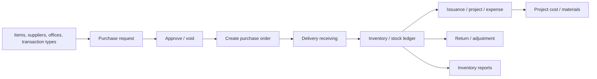
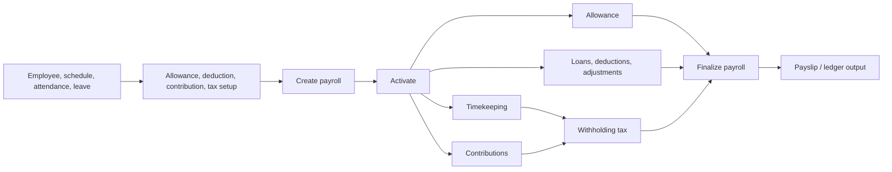

# Frontend Feature Workflows

## Product map

The main menu exposes Inventory, Accounting, HR & Payroll, Administration, and motorpool/other operations. Each consists of a Page Router URL wrapper, route implementation, reusable components, hooks, and backend GraphQL/REST calls. The frontend renders and guides workflows; the backend remains authoritative for final state, permissions, company isolation, and posting.

## Inventory and purchasing

Inventory screens include master data (items, suppliers, categories/groups/units, transaction types, signatures), purchase requests/orders, receiving, returns, stock issuances, adjustments, beginning balances, markup, monitoring, projects, and assets.

The feature routes live under `routes/inventory/`; shared forms/tables/dialogs under `components/inventory/`; operations and typed data under `graphql/inventory/` and `hooks/inventory/`.

Purchase-request/order screens illustrate the expected pattern: filters and zero-based pagination, typed Apollo query/mutation, confirmation for approval/void, password confirmation for sensitive conversion, success/error messages, then refetch. Receiving and issue forms also lock editing when a record is posted/voided. Preserve all of these conditions when modifying a document action.

Inventory uploads use backend REST endpoints through Ant Design upload `action` URLs. Reports often open the matching backend PDF/CSV endpoint in a new window. Ensure current-company data, record status, permission, and selected document category remain intact through changes.

## Accounting, AP, AR, billing, and cashiering

Accounting routes cover setup (periods, chart of accounts, integrations, templates, banks), transaction journals, accounts payable, accounts receivable, billing, cashiering, loans, fixed assets, and financial/general-ledger reports.

| Area | Primary UI locations | Examples |
| --- | --- | --- |
| Accounting setup | `routes/accounting/accounting-setup/` | fiscal periods, accounts, integrations, templates, banks |
| Transaction journal | `routes/accounting/transaction-journal/` | all/general/sales/disbursement/purchases/receipts journals |
| Accounts payable | `routes/accounting/accounts-payable/`, `components/accounting/payables/` | payables, vouchers, checks, petty cash, debit memo/advice, 2307, reports |
| Accounts receivable | `routes/accounting/accounts-receivable/`, `components/accountReceivables/` | clients, invoices, payments, credit notes, configuration |
| Billing/cashier | `routes/accounting/billing/`, `cashier/`, components | folios, billing detail, terminals, payments/voids, collection reports |
| Reports | `routes/accounting/reports/`, components | general ledger and configurable financial reports |

These screens frequently use totals, selected items, account postings, fiscal periods, status/void actions, report downloads, and password confirmation. Validation in `utility/helper.ts` (for example disbursement balancing) is user guidance, not a replacement for backend validation. Do not change a client-side total or enable a button without tracing the backend mutation and ledger result.

The frontend opens REST report documents (e.g., invoices, credit notes, APV/disbursement/checks, ledger exports) with `window.open`. Keep query IDs/date parameters, authenticated session behavior, and error feedback correct. A report feature is complete only when the output content—not merely the popup—matches the source document for the current company.

## HR, employee management, and payroll

HR/payroll screens include payroll configurations, employee profiles/documents/allowances/loans/attendance/leave, work schedules, attendance management, and payroll management with employee submodule screens.

Payroll route screens are in `routes/payroll/payroll-management/`; reusable actions and tables live in `components/payroll/`; feature hooks are grouped in `hooks/payroll/` including `timekeeping`, `allowance`, `contributions`, `loans`, `other-deductions`, and `adjustments`.

The UI must reflect legal backend states. Existing screens use generated `PayrollStatus`, `PayrollEmployeeStatus`, and `PayrollModule` types, per-employee and bulk recalculation actions, and refetches after status updates. Preserve module prerequisites and allow server failure messages to remain visible. Do not optimistically mark a payroll/employee finalized locally or bypass an incomplete module because a screen is convenient to edit.

Employee profile/document uploads use dedicated backend REST endpoints. Maintain current employee identity, session authentication, upload success/error handling, and safe display/object URL behavior.

## Projects and assets

Project screens include project master records plus details for materials, expenses, bill quantities, accomplishments, work accomplishments, progress, and inventory. Asset screens include asset master data, configurations, preventative/repair maintenance, rental rates, vehicle usage monitoring, attachments, and accumulated reports.

Project state is available through `AppContext` inside the authenticated shell. Components under `components/inventory/project-details/` manage project data, work-accomplishment state, attachments, and interactions with inventory/billing. Asset screens use `components/inventory/assets/` and `hooks/asset/`.

Changes here can bridge inventory, project cost, billing, files, reports, and accounting. Trace all related mutations and downloads. Lock/post/revise controls must retain their confirmation, permission, current-project, and post-mutation refresh behavior.

## Administration and company context

Administrative routes manage companies, offices, and positions. The logged-in account carries the current company; an administrator can invoke the company-change flow from the main menu. The UI must show data consistent with that server-side company context and reload/refetch after a company change.

Do not use a locally selected company ID to override a backend company decision. New administrative screens need the same role wrapper and server permission behavior as nearby administration pages.

## Cross-cutting UI workflow rules

For every user-visible business action:

1. Load the current server record/state rather than relying on stale local state.
2. Apply the established page role and button-level permission gate.
3. Confirm destructive/finalizing/reversing actions using the nearest dialog/password-confirmation pattern.
4. Submit the typed GraphQL mutation or established REST request.
5. Surface success and backend error messages; avoid swallowing GraphQL errors.
6. Refetch/update the view using the surrounding feature’s pattern.
7. Verify related status/ledger/report effects for financial, inventory, payroll, and project actions.
