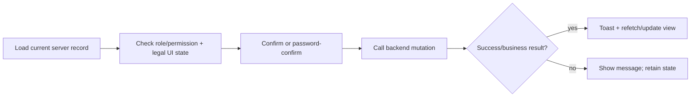

# UI and Access Conventions

## Add a page correctly

Follow the nearest page in the same module. The normal sequence is:

1. Create `pages/<module>/...` for the URL.
2. Add a clear `<Head><title>` and the expected `AccessManager` role wrapper.
3. Dynamically import or use `asyncComponent` for the matching `routes/<module>/...` implementation.
4. Pass `account` where the route/component expects `IPageProps`.
5. Add module-sidebar/dashboard menu configuration if the screen should be discoverable.
6. Add the feature’s GraphQL hooks/components under its existing module group rather than creating a cross-module catch-all.

Page wrappers must not contain a second full implementation while an equivalent `routes/` pattern exists. This separation keeps routing/access review distinct from feature complexity.

## Access control

There are two UI gates:

| Component | Input | Intended use |
| --- | --- | --- |
| `AccessManager` | `roles` | Whole page/section role gate; renders the 403 page when denied |
| `AccessControl` | `allowedPermissions` | Fine-grained control/action gate; can render nothing or alternate UI |

Roles are read from `account.user.roles`; fine-grained access values are read from `account.user.access`. Do not swap their argument order or reuse a role name where a permission string is expected. UI access checks improve usability but cannot authorize a write: the backend must reject unauthorized changes as well.

For a new action, find the nearest similar action and apply the same page role plus button-level permission. Verify both the hidden/403 UI case and direct interaction against a backend-denied account when possible.

## Forms, dialogs, and tables

The UI uses Ant Design/Ant Design Pro forms/tables together with reusable controls from `components/common/` and module-specific modal/dialog components. Common patterns include:

- screen route owns filters, table/page state, parent refetch, and action callbacks;
- a modal receives `record`, category/status/disabled props, plus a `hide` callback from `useDialog`;
- mutations show `message.success` or `message.error` based on the backend response;
- list screens reset page to zero when a search/filter changes;
- `loading` disables/spins the relevant interaction;
- dialogs and destructive actions use Ant Design confirmation and sometimes `useConfirmationPasswordHook`.

Reuse `FormSelect`, date/number inputs, document upload controls, table components, modal patterns, and shared helpers before adding new bespoke primitives. This avoids different parsing, validation, date, and layout behavior for the same business concept.

## Status, approval, posting, voiding, and delete actions

These operations can alter inventory, accounting, payroll, or reportability. The UI must not treat them as a generic toggle.

Requirements:

- derive allowed actions from the latest server record, not a stale table snapshot;
- preserve checks for already-approved, posted, finalized, delivered, voided, or locked documents;
- preserve confirmation content, permission gates, and sensitive-action password confirmation when the surrounding feature uses them;
- call the established mutation and respect its success/message payload;
- refetch all affected list/detail/totals after success; and
- do not set final status optimistically before the backend confirms it.

For payroll, use generated status/module enums and existing recalculation action components/hooks. For inventory/AP/AR/billing/project work, trace related reports/ledger/totals before changing an action label or availability.

## Data formatting and dates

Use shared helpers from `utility/helper.ts`, constants from `utility/constant.ts`, and module-specific formatters for user-facing dates, currency, decimal rounding, filters, and status colors. The application uses Philippine peso-oriented display values and a global VAT constant in utility code; do not duplicate or silently alter those rules in an individual form.

The backend commonly expects timestamp/instant-compatible values. Use `dayjs` and existing range/date conversion helpers. Confirm whether an endpoint expects an instant, date-only string, or local date before changing a form value. Time-zone errors are especially costly for payroll attendance, period boundaries, and reports.

## Errors, loading, and navigation

- Use `CircularProgress`/`Spin` or nearby component patterns for initial loading and `loading` flags for mutations.
- Handle Apollo network errors (including session 401) and business failures returned inside GraphQL data.
- Do not hide errors with unconditional redirects, console-only logging, or dialog closure.
- Use `router.push` for in-app navigation; use `window.open` only for intentional new-tab documents/folios/report flows.
- Keep browser-only APIs within event/effect/client-render paths; many route components disable SSR intentionally.

## Component/hook placement guide

| Need | Place it in |
| --- | --- |
| URL and broad access/title | `pages/` |
| Full screen composition | `routes/<module>/` |
| Module-specific table/form/modal | `components/<module>/` |
| Shared field, date, selector, modal primitive | `components/common/` |
| Reused remote query/mutation behavior | `hooks/<module>/` |
| Shared GraphQL document | `graphql/<module>/` |
| Generated backend schema types | `graphql/gql/` (generated only) |
| Shared constants/types/formatters | `constant/`, `interface/`, `utility/` |

## Review checklist

- Is the screen in the correct page/route/component/hook layer?
- Does direct navigation have the intended role gate?
- Does a sensitive control use the correct permission and server mutation?
- Are types, nullable values, filters, and zero-based pagination correct?
- Do success/failure states provide feedback and refresh server data?
- Are dates/currency/files/reports using existing utilities and safe URLs?
- Does the change avoid leaking customer, payroll, session, or credential information?
